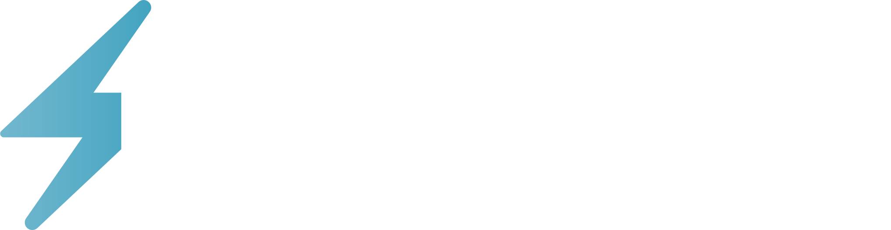

# FlashLearn
A flashcard web app that supercharges your learning.  
Link to the app: https://www.flashlearn.io  
  
   
## Technologies Used
1. Vue.js (Javascript framework)  
2. Vuetify (UI library framework)  
3. Amazon Web Services (Cloud service)  
  
## Features of this app
-  **Test yourself with your own flashcards**📝 
Create your personal digital flashcards and test yourself using your flashcards.  
  
-  **Put flashcards in decks**📚  
Arrange your digital flashcards into different decks to keep them organised. ✨  
  
-  **Too lazy to make flashcards? 🤷‍♂️ Try FlashGen**⚡️⚡️  
Powered by AI, FlashGen helps you generate flashcards based on a paragraph of text provided by you in seconds🤯. It can be content from your notes or a paragraph from an article.  

